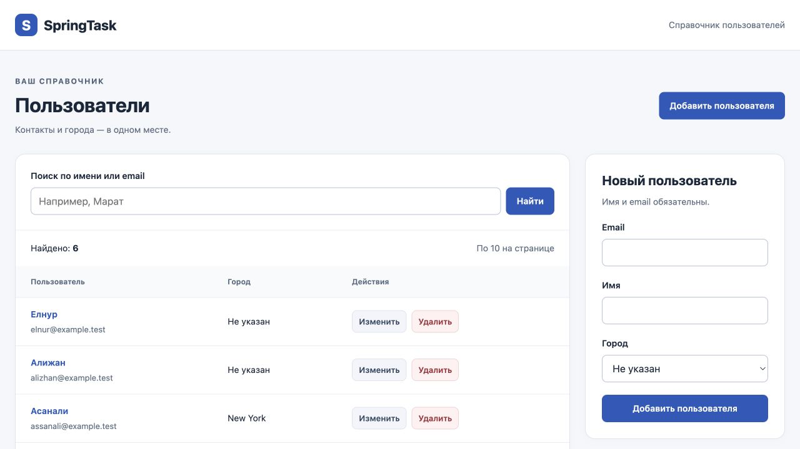
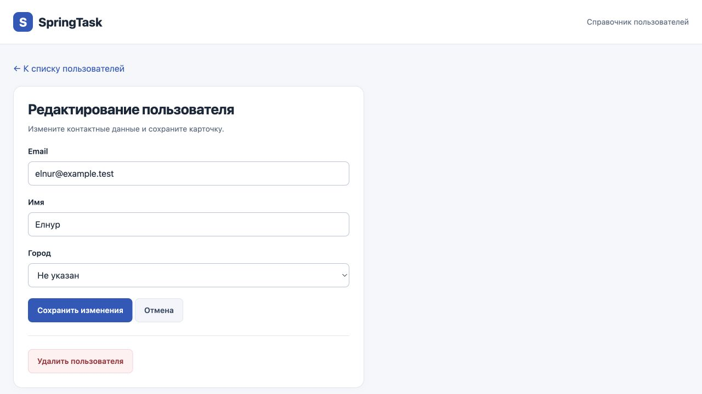

# SpringTask — справочник пользователей

Учебное веб-приложение на Java и Spring Boot: контакты пользователей,
поиск по имени или email, редактирование карточек и хранение в PostgreSQL.
Проект развивает университетское задание по Spring MVC; коммерческого применения нет.

## Как выглядит



<details>
<summary>Карточка пользователя</summary>



</details>

На скриншотах — только демонстрационные данные с адресами `example.test`.

## Возможности

- Создание, просмотр, редактирование и удаление пользователей.
- Имя, email и необязательный город из справочника.
- Поиск без учёта регистра и страницы списка по 10 записей; новые записи идут первыми.
- Проверка форм с сообщениями об ошибках и сохранением введённых значений.
- Подтверждение удаления и уведомления об успешных действиях.
- CSRF-защита POST-форм; страницы ошибок 403 и 404.
- PostgreSQL, миграции Flyway и демонстрационные данные при первом запуске.
- Локальные стили и JavaScript: оформление не зависит от CDN.

## Стек и архитектура

Java 17 · Spring Boot 4.0.8 · Spring MVC · Thymeleaf · Spring Security ·
Bean Validation · Spring Data JPA · PostgreSQL 16 · Flyway · Gradle 8.14.3 ·
JUnit 6 · MockMvc.

```text
Браузер → Spring Security → HomeController → UserService → Repository → PostgreSQL
                                  ↓
                            Thymeleaf / HTML
```

| Каталог в `src/main` | Назначение |
| --- | --- |
| `java/kz/bitlab/G118springfirstapp/controller` | HTTP-запросы и подготовка страниц |
| `java/kz/bitlab/G118springfirstapp/service` | Операции с пользователями и транзакции |
| `java/kz/bitlab/G118springfirstapp/repository` | Доступ к данным через JPA |
| `java/kz/bitlab/G118springfirstapp/model` | Сущности `User` и `City` |
| `java/kz/bitlab/G118springfirstapp/form` | Поля формы и правила валидации |
| `java/kz/bitlab/G118springfirstapp/config` | Настройки CSRF-защиты |
| `resources/db/migration` | Версионируемые изменения БД |
| `resources/templates`, `resources/static` | Страницы, стили и JavaScript |

Flyway создаёт схему, Hibernate проверяет её соответствие сущностям
(`ddl-auto=validate`). Повторный запуск сохраняет изменения пользователей и
не добавляет демонстрационные записи заново.

## Быстрый запуск

Нужны JDK 17 (актуальное исправление) и запущенный Docker с Compose.
Docker запускает PostgreSQL, приложение работает через Gradle или IntelliJ IDEA.

```sh
git clone https://github.com/Eqwert1212/springtask.git
cd springtask
docker compose up -d --wait
bash gradlew bootRun
```

Откройте [localhost:8000](http://localhost:8000).
На Windows вместо `bash gradlew` используйте `gradlew.bat`.

Для свежего клона дополнительная настройка не требуется: база `springtask`,
пользователь `springtask`, демонстрационный пароль `springtask_local`, порт `5433`.
Если уже есть `.env.local`, его значения могут переопределять эти настройки.
Настоящие пароли не следует записывать в исходники или коммитить.

Остановка базы с сохранением данных:

```sh
docker compose stop
```

Данные находятся в volume `postgres_data`. Удаление volume удалит и данные.

### IntelliJ IDEA

Откройте папку проекта как Gradle-проект. Выберите JDK 17 для Project SDK и
Gradle JVM, дождитесь синхронизации и запустите `G118SpringFirstAppApplication`.
Рабочая папка запуска — корень проекта. PostgreSQL должен быть запущен заранее.
После перезапуска обновите старые вкладки браузера, чтобы получить новые CSRF-токены.

### PostgreSQL без Docker

Создайте отдельные пустые базы для приложения и тестов. Впишите настройки
в `.env.local` по образцу [.env.example](.env.example) или задайте переменные
окружения в IntelliJ/терминале:

| Переменная | Значение по умолчанию |
| --- | --- |
| `DB_URL` | `jdbc:postgresql://localhost:5433/springtask` |
| `DB_USER` / `DB_PASSWORD` | `springtask` / `springtask_local` |
| `TEST_DB_URL` | `jdbc:postgresql://localhost:5433/springtask_test` |
| `TEST_DB_USER` / `TEST_DB_PASSWORD` | Берутся из `DB_USER` / `DB_PASSWORD` |
| `SERVER_PORT` | `8000` |

Для стандартного порта PostgreSQL замените `5433` на `5432`.
`.env.local` исключён из Git и читается приложением из рабочей папки.
Формат — Java properties: `КЛЮЧ=значение`, без кавычек; обратную косую черту
в значении нужно удваивать. Переменные окружения имеют приоритет.
Docker Compose не читает `.env.local` автоматически: при изменении пароля
задайте одинаковый `DB_PASSWORD` для контейнера и приложения. Изменение
переменной контейнера не меняет пароль в уже существующей базе.

## Тесты и сборка

Тесты используют отдельную базу. Для запуска с Docker создайте её один раз:

```sh
docker compose exec db createdb -U springtask springtask_test
bash gradlew clean check bootJar
```

При использовании установленного PostgreSQL укажите `TEST_DB_URL` и данные
подключения. Не направляйте тесты в рабочую базу: они применяют миграции.
Изменения записей в автоматических тестах откатываются транзакциями;
пропуски в последовательности ID допустимы.

Проверяются CRUD через JPA, валидация и защита от изменения лишних полей,
неверные города, 404, поиск, пагинация, наличие CSRF-токенов и запрет
изменяющих запросов без правильного токена.

- Отчёт тестов: `build/reports/tests/test/index.html`.
- Исполняемый файл: `build/libs/G118-spring-first-app-0.0.1-SNAPSHOT.jar`.
- Сборка без тестов: `bash gradlew bootJar`.

### GitHub Actions

[Workflow CI](.github/workflows/ci.yml) запускается при push, pull request и вручную.
Он поднимает отдельный PostgreSQL 16, устанавливает JDK 17, проверяет Gradle
Wrapper, выполняет `clean check bootJar` и сохраняет отчёт тестов на 7 дней.
Пароль тестового контейнера демонстрационный; доступ к локальной базе и GitHub
Secrets не требуется. Результаты будут доступны во вкладке **Actions** после
публикации workflow в GitHub. Наличие файла ещё не означает успешный запуск CI.

## Ограничения и безопасность

Это справочник, а не система учётных записей. Нет входа и разграничения прав;
пароли пользователей не хранятся. CSRF защищает отправку форм, но не заменяет
авторизацию. Для публичного размещения потребуется отдельная доработка доступа.
Используйте демонстрационные данные. Подтверждение удаления работает при
включённом JavaScript. Городской справочник пока задаётся миграцией.

[Проверка зависимостей](docs/dependency-review.md) описывает обновление библиотек,
временную фиксацию Tomcat и результат проверки OSV на указанную дату.
Она не гарантирует отсутствие всех уязвимостей и не заменяет регулярные обновления.

## Контекст проекта

Исходное задание использовало список пользователей в памяти. В текущей версии
добавлены постоянное хранение, разделение контроллера, сервиса и репозиториев,
валидация, CSRF, пагинация, тесты и воспроизводимые инструкции запуска.
Это небольшой учебный проект для демонстрации основ Java backend и Spring MVC.
